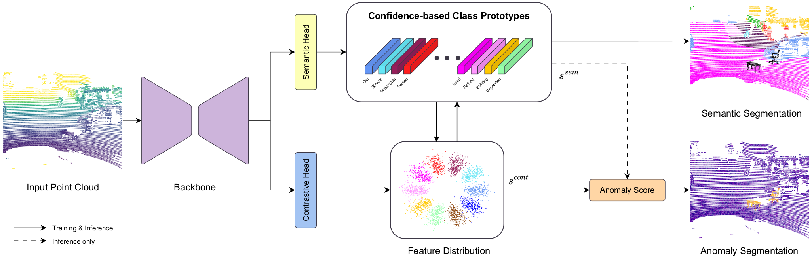

<div align="center">
<h1>Learning to Identify Out-of-Distribution Objects for 3D LiDAR Anomaly Segmentation</h1>

[**Simone Mosco**](https://simom0.github.io/), [**Daniel Fusaro**](https://bender97.github.io/),
[**Alberto Pretto**](https://albertopretto.altervista.org/)

University of Padova

**CVPR 2026**

<a href="https://arxiv.org/pdf/2604.23604"></a>
<a href="https://simom0.github.io/lido-page/"></a>
<a href='https://huggingface.co/Simom0/LIDO'></a>
<a href="#"></a>



</div>

**LIDO** is a novel approach for 3D LiDAR anomaly segmentation that directly works on the feature space to distinguish between inlier known classes and anomalous objects, relying on a combination of training losses and inference scores to produce both semantic and anomaly segmentation.
We also introduce three new mixed real-synthetic OoD datasets for 3D LiDAR anomaly segmentation, based on established autonomous driving benchmarks. We design a pipeline to insert and geometrically align synthetic 3D objects into real LiDAR scans, including realistic intensities computation.

## News

- **2026-04-29**: Code is released.
- **2026-02-21**: LIDO is accepted to CVPR 2026.

## Installation

Create an environment and install the required packages with `pip install -r requirements.txt`.

We also provide a pre-built [singularity image](https://drive.google.com/file/d/1UE5izpqPRhDdohg7MgYEZsrIWPYdSVZC/view?usp=sharing) for quick usage. 

Please refer to [INSTALL.md](./INSTALL.md) for further details and step-by-step guide to setup the environment.

## Data Preparation

### STU

Download STU dataset from the [official webiste](https://github.com/kumuji/stu_dataset?tab=readme-ov-file).

### SemanticKITTI

Download SemanticKITTI dataset from the [official website](https://semantic-kitti.org/).

### SemanticPOSS

Download SemanticPOSS dataset from the [official website](http://www.poss.pku.edu.cn/semanticposs.html).

### nuScenes

Download nuScenes dataset from the [official website](https://nuscenes.org/nuscenes). Convert it into KITTI format using the script [nuscenes2kitti](https://github.com/PRBonn/nuscenes2kitti).

### OoD Datasets

Please refer to [DATA.md](./DATA.md) for the details to prepare SemanticKITTI-OoD, SemanticPOSS-OoD and nuScenes-OoD datasets.

## Training

Run the following commands to train, specifying the dataset and log paths:

```shell
### SemanticKITTI
python train.py --dataset /path/to/semantickitti/ --data ./config/labels/semantic-kitti.yaml --config ./config/MinkowskiNet-semantickitti.yaml --log ./log/kitti [--fp16]

### nuScenes
python train.py --dataset /path/to/nuscenes/ --data ./config/labels/nuscenes.yaml --config ./config/MinkowskiNet-nuscenes.yaml --log ./log/nuscenes [--fp16]

### SemanticPOSS
python train.py --dataset /path/to/semanticposs/ --data ./config/labels/semantic-poss.yaml --config ./config/MinkowskiNet-poss.yaml --log ./log/poss [--fp16]
```

## Testing

Run the following scripts to infer on a specific dataset:

```shell
### STU
python infer.py --dataset /path/to/stu/ --data ./config/labels/stu.yaml --config ./config/MinkowskiNet-semantickitti.yaml --log /path/to/predictions --model /path/to/modeldir/ --split train/valid/test [--save] [--fp16]

### SemanticKITTI-OoD
python infer.py --dataset /path/to/kitti-ood/ --data ./config/labels/semantic-kitti.yaml --config ./config/MinkowskiNet-semantickitti.yaml --log /path/to/predictions --model /path/to/modeldir/ --split train/valid/test [--save] [--eval] [--fp16]

### nuScenes-OoD
python infer.py --dataset /path/to/nuscenes-ood/ --data ./config/labels/nuscenes.yaml --config ./config/MinkowskiNet-nuscenes.yaml --log /path/to/predictions --model /path/to/modeldir/ --split train/valid/test [--save] [--eval] [--fp16]

### SemanticPOSS-OoD
python infer.py --dataset /path/to/poss-ood/ --data ./config/labels/semantic-poss.yaml --config ./config/MinkowskiNet-semanticposs.yaml --log /path/to/predictions --model /path/to/modeldir/ --split train/valid/test [--save] [--eval] [--fp16]

### E.g. for STU and pretrained model
# python infer.py --dataset /STU_dataset/ --data ./config/labels/stu.yaml --config ./config/MinkowskiNet-semantickitti.yaml --log ./stu_preds --model /path/to/modeldir/ --split valid --save --fp16

### E.g. for SemanticKITTI-OoD (multi)
# python infer.py --dataset /kitti-ood-multi/ --data ./config/labels/semantic-kitti.yaml --config ./config/MinkowskiNet-semantickitti.yaml --log ./kitti_ood_preds --model /path/to/modeldir/ --split valid --save --fp16
```

Specify the `--save` argument to save both semantic predictions and anomaly scores to the log path. Use `--eval` to run also the semantic segmentation evaluation (be aware that this works only for the proposed OoD datasets as STU does not provide full semantic labels for the validation and test splits).

### Anomaly Evaluation

To run the OoD evaluation we provide an adapted script from the official [STU repo](https://github.com/kumuji/stu_dataset). For further details please refer to their original implementation.

```bash
python3 compute_point_level_ood.py --data-dir /ood-dataset/sequences/ --pred-dir /ood-predictions/

### E.g. for SemanticKITTI-OoD (multi)
# python3 compute_point_level_ood.py --data-dir /kitti-ood-multi/sequences/ --pred-dir /kitti-ood-predictions/
```

## Model Zoo

Pretrained models are available on [Hugging Face](https://huggingface.co/Simom0/LIDO).

## Checklist

- [x] Update README
- [x] Release code
- [ ] Upload models
- [ ] Upload data

## Citation

If you find our work useful please cite our paper:

```
@inproceedings{mosco2026learning,
    title={Learning to Identify Out-of-Distribution Objects for 3D LiDAR Anomaly Segmentation},
    author={Mosco, Simone and Fusaro, Daniel and Pretto, Alberto},
    booktitle={IEEE/CVF Conference on Computer Vision and Pattern Recognition (CVPR)},
    year={2026}
}
```

## Acknowledgment

Code is built upon [TorchSparse](https://github.com/mit-han-lab/torchsparse), [STU](https://github.com/kumuji/stu_dataset), [ContMAV](https://github.com/PRBonn/ContMAV), [RangeRet](https://github.com/SiMoM0/RangeRet), [2DPASS](https://github.com/yanx27/2DPASS).